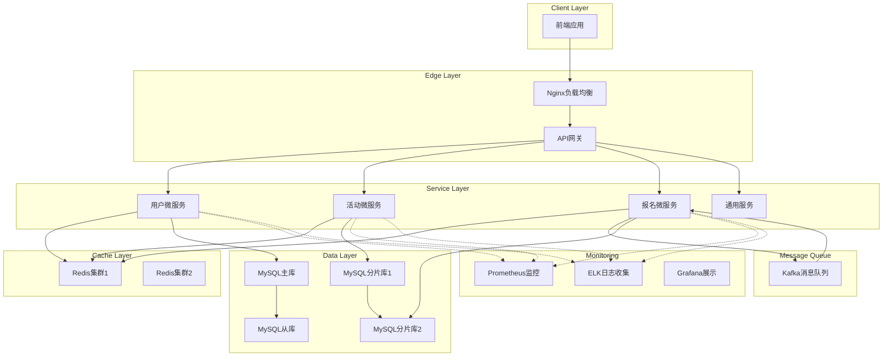

# 校园活动报名系统 - 高并发Web系统架构设计与性能优化方案

## 项目概述

本项目为校园活动报名系统设计了一套高并发、高可用、可扩展的后端架构，并提出了完整的性能优化方案。系统采用微服务架构，具备处理高并发报名场景的能力。

## 架构设计 (40%)

### 1. 系统架构图



### 2. 组件职责与交互方式

#### 前端层
- **职责**: 提供用户界面，处理用户交互
- **技术**: Vue.js/React + Element UI/Ant Design
- **功能**: 用户注册登录、活动浏览、报名操作、个人中心

#### 边缘层
- **Nginx负载均衡**
  - 负载均衡，分发请求到API网关集群
  - 静态资源服务
  - SSL终止

- **API网关**
  - 统一入口，路由转发
  - 限流熔断
  - 认证鉴权
  - 日志记录
  - 协议转换

#### 服务层

**用户微服务 (User Service)**
- **职责**: 用户管理、认证授权
- **功能**: 用户注册/登录、权限管理、个人信息管理
- **数据**: 用户基本信息、权限信息
- **接口**: /api/user/login, /api/user/register, /api/user/profile

**活动微服务 (Activity Service)**
- **职责**: 活动管理
- **功能**: 活动发布/编辑/删除、活动查询/搜索、活动分类管理
- **数据**: 活动信息、分类信息
- **接口**: /api/activity/list, /api/activity/detail, /api/activity/create

**报名微服务 (Registration Service)**
- **职责**: 报名处理、状态管理
- **功能**: 报名申请处理、报名状态管理、报名统计分析
- **数据**: 报名记录、报名状态
- **接口**: /api/registration/enroll, /api/registration/status

**通用服务 (Common Service)**
- **职责**: 公共功能
- **功能**: 验证码服务、文件上传、消息通知、配置管理

### 3. 数据库分库分表策略

#### 分库策略
```
用户库 (user_db): user, system_config 表
活动库 (activity_db): activity, activity_category 表
报名库 (registration_db): registration, activity_favorite, notification 表
```

#### 分表策略
- **用户表分表**: 按user_id hash分表 (user_0, user_1, user_2, user_3)
- **活动表分表**: 按activity_id hash分表 (activity_0, activity_1, activity_2, activity_3)
- **报名表分表**: 按activity_id hash分表 (registration_0 至 registration_7)

## 性能与安全优化 (40%)

### 1. 高并发场景瓶颈分析与解决方案

**报名瞬间流量激增**
- **问题**: 活动开放报名时大量用户同时请求
- **解决方案**: 
  - 使用Kafka消息队列实现异步报名处理
  - Redis缓存热点活动信息
  - 限流机制控制请求速率

### 2. 缓存策略

**活动信息缓存**
- 活动详细信息: TTL 30分钟
- 活动列表: TTL 10分钟
- 热门活动列表: TTL 15分钟
- 报名开放活动列表: TTL 5分钟

**用户信息缓存**
- 用户详细信息: TTL 1小时
- 用户公开信息: TTL 2小时

### 3. 消息队列异步处理

**报名请求异步处理流程**
```
用户提交报名请求
        ↓
API网关接收请求
        ↓
验证请求参数
        ↓
检查活动是否可报名
        ↓
发送报名消息到Kafka
        ↓
返回"已接收"响应给用户
        ↓
Kafka消费者异步处理报名
        ↓
更新数据库
        ↓
发送通知给用户
```

### 4. 防刷与限流机制

**令牌桶算法实现限流**
- 全局限流: 100次/分钟/IP
- 登录用户: 200次/分钟/用户
- 报名接口: 5次/分钟/用户

**验证码机制**
- 高并发场景下启用验证码
- 图形验证码、滑块验证码

**行为分析防刷**
- 分析用户报名行为模式
- 识别异常操作行为

### 5. 安全防护措施

**身份认证与授权**
- JWT令牌认证
- 基于角色的访问控制 (RBAC)

**输入验证与过滤**
- Bean Validation参数校验
- SQL注入防护
- XSS防护

**传输安全**
- HTTPS强制使用
- 敏感数据加密存储

## 容灾与监控方案 (20%)

### 1. 服务冗余与负载均衡

**服务冗余**
- 每个微服务部署多个实例
- 容器化部署，支持自动扩缩容

**负载均衡**
- Nginx实现应用层负载均衡
- Ribbon实现客户端负载均衡

### 2. 监控告警方案

**Prometheus指标监控**
- 自定义业务指标
- JVM监控
- Web请求监控

**ELK日志分析**
- 结构化日志收集
- 日志搜索与分析
- 异常日志告警

**分布式链路追踪**
- Spring Cloud Sleuth + Zipkin
- 全链路性能分析

### 3. 灰度发布与回滚

**灰度发布策略**
- 基于用户ID或IP的灰度发布
- 渐进式流量切换
- 实时监控灰度效果

**回滚机制**
- 版本快速回滚
- 配置快速回滚
- 数据库版本管理

## 技术栈总结

- **后端**: Spring Boot, Spring Cloud, Spring Security
- **数据库**: MySQL集群，分库分表
- **缓存**: Redis集群
- **消息队列**: Apache Kafka
- **监控**: Prometheus + Grafana, ELK Stack
- **容器化**: Docker, Kubernetes
- **API网关**: Spring Cloud Gateway

## 性能指标

- **并发处理能力**: 支持10,000+ QPS
- **响应时间**: 95%请求 < 200ms
- **可用性**: 99.9%
- **扩展性**: 支持水平扩展

本方案通过微服务架构、缓存策略、异步处理、限流防刷等技术手段，构建了一套高并发、高可用的校园活动报名系统，能够有效应对高并发报名场景，保障系统稳定运行。