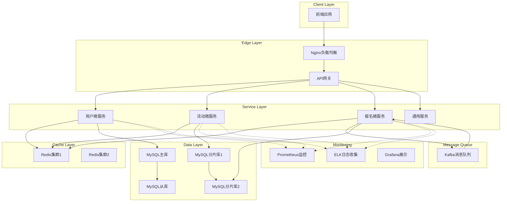

# 校园活动报名系统架构设计

## 系统架构图

## 组件职责与交互方式

### 1. 前端层
- **职责**: 提供用户界面，处理用户交互
- **技术**: Vue.js/React + Element UI/Ant Design
- **功能**: 用户注册登录、活动浏览、报名操作、个人中心

### 2. 边缘层
- **Nginx负载均衡**
  - 负载均衡，分发请求到API网关集群
  - 静态资源服务
  - SSL终止

- **API网关**
  - 统一入口，路由转发
  - 限流熔断
  - 认证鉴权
  - 日志记录
  - 协议转换

### 3. 服务层

#### 用户微服务 (User Service)
- **职责**: 用户管理、认证授权
- **功能**:
  - 用户注册/登录
  - 权限管理
  - 个人信息管理
- **数据**: 用户基本信息、权限信息
- **接口**: /api/user/login, /api/user/register, /api/user/profile

#### 活动微服务 (Activity Service)
- **职责**: 活动管理
- **功能**:
  - 活动发布/编辑/删除
  - 活动查询/搜索
  - 活动分类管理
- **数据**: 活动信息、分类信息
- **接口**: /api/activity/list, /api/activity/detail, /api/activity/create

#### 报名微服务 (Registration Service)
- **职责**: 报名处理、状态管理
- **功能**:
  - 报名申请处理
  - 报名状态管理
  - 报名统计分析
- **数据**: 报名记录、报名状态
- **接口**: /api/registration/enroll, /api/registration/status

#### 通用服务 (Common Service)
- **职责**: 公共功能
- **功能**:
  - 验证码服务
  - 文件上传
  - 消息通知
  - 配置管理

### 4. 缓存层
- **Redis集群**
  - 活动信息缓存
  - 热点数据缓存
  - 会话信息存储
  - 分布式锁实现

### 5. 消息队列
- **Kafka**
  - 异步报名处理
  - 解耦服务调用
  - 削峰填谷
  - 事件通知

### 6. 数据层
- **MySQL集群**
  - 主从复制，读写分离
  - 分库分表策略
  - 数据备份与恢复

### 7. 监控层
- **Prometheus**: 指标收集与监控
- **ELK**: 日志收集与分析
- **Grafana**: 监控数据可视化

## 服务间通信方式

### 同步通信
- REST API: 服务间直接HTTP调用
- 使用Feign客户端实现服务调用

### 异步通信
- Kafka消息队列: 事件驱动，解耦服务
- 用于报名异步处理、通知发送等

### 服务发现
- 使用Nacos或Eureka实现服务注册与发现
- 客户端负载均衡使用Ribbon

## 高可用设计

### 服务冗余
- 每个微服务部署多个实例
- 容器化部署，支持自动扩缩容

### 数据库高可用
- MySQL主从复制
- 主库故障自动切换

### 缓存高可用
- Redis集群模式
- 数据分片与复制

### 容灾设计
- 多机房部署
- 数据异地备份
- 故障自动转移